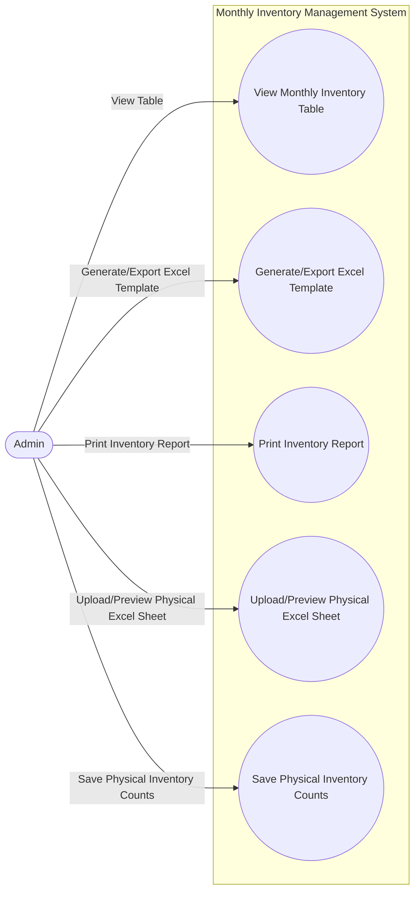

# DomainUseCases

> This repository contains domain-specific use cases, diagrams, and documentation for business processes. It is intended as a reference for modeling, analysis, and implementation of various domain scenarios.

## Repository Structure

- `usecase-monthly-inventory-management.mmd`: Mermaid diagram file describing the monthly inventory management use case.
- `Readme.md`: This file. Provides an overview and documentation for the repository.

## Getting Started

1. **Clone the repository:**
   ```sh
   git clone https://github.com/ahmed-ibrahim-salim/DomainUseCases.git
   ```
2. **Open the Mermaid diagram:**
   - Use a Mermaid live editor (e.g., [Mermaid Live Editor](https://mermaid-js.github.io/mermaid-live-editor/)) to visualize `.mmd` files.

## Use Cases

### Monthly Inventory Management

The `usecase-monthly-inventory-management.mmd` file models the workflow for managing inventory on a monthly basis. Below is the Mermaid diagram source:



## Contributing

Contributions are welcome! Please open issues or submit pull requests for improvements or new use cases.

## License

This repository is licensed under the MIT License.
